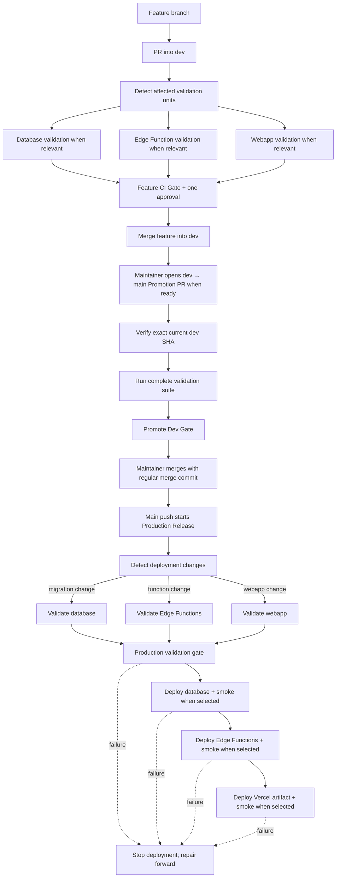

# BossBaby CI/CD pipeline

**Design implemented locally:** 17 August 2026

**Production governance:** requires the bootstrap steps in the [production runbook](production-runbook.md) after these files reach GitHub.

## Outcome

BossBaby now has three independently deployable release units: Supabase database migrations, Supabase Edge Functions, and the Vercel webapp. Each unit owns validation and manual fallback deployment in a reusable workflow. A Production Release Dispatcher validates changed units in parallel, then runs environment-bound production jobs for only those units while preserving database → Edge Functions → webapp ordering for cross-cutting promotions.

This implements [ADR 0013](adr/0013-split-production-releases-by-change-boundary.md), which supersedes the always-coupled release in ADR 0007.

## Pipeline flow

Skipped units do not create dependencies: a frontend-only promotion runs only the webapp deployment, and a migration-only promotion runs only the database deployment.

## Workflows

| Workflow | Trigger | Responsibility |
|---|---|---|
| [`feature-ci.yml`](../.github/workflows/feature-ci.yml) | PR into `dev` | Detect relevant units, call their validation modes, expose stable `Feature CI / Gate` |
| [`promote-dev.yml`](../.github/workflows/promote-dev.yml) | Manually opened PR from `dev` to `main` | Verify exact current `dev` and run the complete promotion suite |
| [`production-release.yml`](../.github/workflows/production-release.yml) | Push to `main` | Detect production changes and invoke affected units in dependency order |
| [`database-release.yml`](../.github/workflows/database-release.yml) | Reusable call or manual recovery | Enforce immutable history, rebuild locally, push migrations, verify remote history |
| [`edge-functions-release.yml`](../.github/workflows/edge-functions-release.yml) | Reusable call or manual recovery | Run Deno checks/tests, deploy all local functions, smoke-test safe read endpoint |
| [`webapp-release.yml`](../.github/workflows/webapp-release.yml) | Reusable call or manual recovery | Run frontend gates, build with Vercel, deploy the prebuilt artifact, smoke-test routes |

## Change boundaries

| Unit | Validation changes | Production deployment changes |
|---|---|---|
| Database | Migrations, Supabase local configuration, database workflow/scripts | New SQL files under `backend/supabase/migrations/` |
| Edge Functions | Function code/tests, Deno configuration/lockfile, Supabase function configuration, Edge workflow | Non-test function runtime code, Deno configuration/lockfile, or Supabase function configuration |
| Webapp | Frontend files, dependency manifests, Vercel configuration, Webapp workflow | Frontend runtime/assets/build configuration, dependency manifests, or Vercel configuration |

Documentation, test-only, lint-only, and Actions-only changes can be validated but never deploy application code.

## Controls

- Production commits come only from an exact-current-`dev` Promotion PR.
- Feature PRs require relevant CI and one approval; promotion repeats the complete suite.
- A maintainer decides when the integrated `dev` state is ready, then manually opens and merges the Promotion PR after its gate passes.
- Production revalidates all selected units in parallel against the exact release commit before any deployment starts.
- Migrations already present on `main` cannot be edited or deleted.
- Production dispatchers queue and never cancel an active release.
- Manual unit deployments reject any revision other than current `main`.
- The existing `Production` environment is retained. Automated deployment jobs bind to it directly so environment secrets remain available; manual unit workflows use the same environment. Every deployment fails clearly before mutation if a required credential is unavailable.
- The `Production` environment must allow deployments from `main` only, preventing feature-branch workflow edits from receiving production secrets.
- Vercel and Supabase native Git deployment remain disabled, so GitHub Actions is the sole production owner.
- Database changes are forward-only and must remain compatible with separately released clients and functions.

## Bootstrap status

The repository currently has no branch protection. Workflow files must be published and their check names observed before enabling the rules described in the [production runbook](production-runbook.md). Applying those rules earlier could make `dev` and `main` unmergeable.
